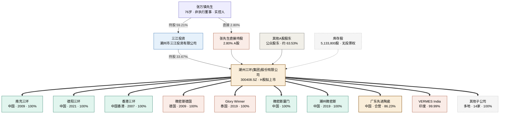

```mermaid
flowchart TD
    Z["张万镇先生<br/>76岁 · 非执行董事 · 实控人"]:::purple
    SJ["三江投资<br/>潮州市三江投资有限公司"]:::blue
    DIR["张先生直接持股<br/>2.80% A股"]:::coral
    CO["潮州三环(集团)股份有限公司<br/>300408.SZ · H股拟上市"]:::amber
    PUB["其他A股股东<br/>公众股东 · 约 63.53%"]:::gray
    STK["库存股<br/>5,133,800股 · 无投票权"]:::gray2

    Z -->|"持股 59.21%"| SJ
    Z -->|"直接 2.80%"| DIR
    SJ -->|"持股 33.67%"| CO
    DIR --> CO
    PUB --> CO
    STK -.-> CO

    CO ==> NC["南充三环<br/>中国 · 2009 · 100%"]:::teal
    CO ==> DY["德阳三环<br/>中国 · 2021 · 100%"]:::teal
    CO ==> HK["香港三环<br/>中国香港 · 2007 · 100%"]:::teal
    CO ==> DE["微密斯德国<br/>德国 · 2009 · 100%"]:::coral
    CO ==> TH["Glory Winner<br/>泰国 · 2019 · 100%"]:::coral
    CO ==> XM["微密斯厦门<br/>中国 · 100%"]:::teal
    CO ==> CZ["潮州微密斯<br/>中国 · 2019 · 100%"]:::teal
    CO ==> GD["广东先进陶瓷<br/>中国 · 合营 · 86.23%"]:::amber
    CO ==> IN["VERMES India<br/>印度 · 99.99%"]:::coral
    CO ==> OT["其他子公司<br/>多地 · 14家 · 100%"]:::gray2

    classDef purple fill:#EEEDFE,stroke:#534AB7,stroke-width:1px,color:#000
    classDef blue fill:#E6F1FB,stroke:#185FA5,stroke-width:1px,color:#000
    classDef coral fill:#FAECE7,stroke:#993C1D,stroke-width:1px,color:#000
    classDef amber fill:#FAEEDA,stroke:#854F0B,stroke-width:1.5px,color:#000
    classDef teal fill:#E1F5EE,stroke:#0F6E56,stroke-width:1px,color:#000
    classDef gray fill:#F1EFE8,stroke:#5F5E5A,stroke-width:1px,color:#000
    classDef gray2 fill:#F5F5F5,stroke:#999,stroke-width:1px,stroke-dasharray:3 3,color:#000
```
